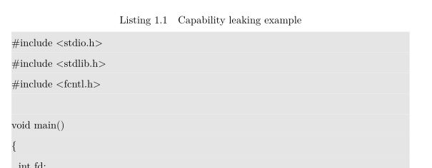
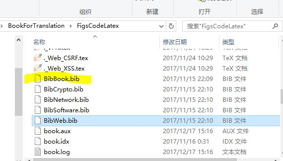
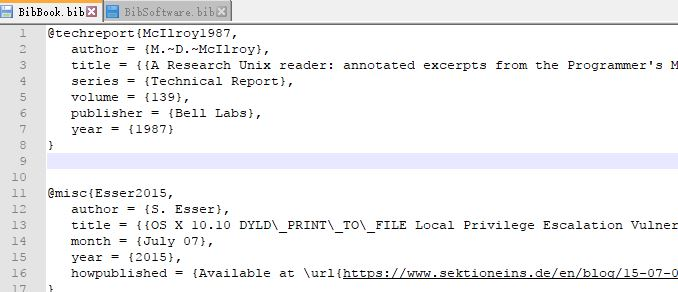

# LaTeX翻译模板使用说明
* 在浙大博士论文模板```zjucs_thesis```的基础上，结合```BookForTranslation```文件，初步设置了翻译排版格式。 
* 本人使用的是是ctex套装，winEdt编辑器。这是ctex套装的下载地址 http://www.ctex.org/CTeXDownload
## 1. 一些说明
1.```zjucs_thesis\main.tex```可以使用```xelatex```引擎编译。如果不想看其他章节的内容，只要在```zjucs_thesis\main.tex```中把那部分注释掉即可。
模板中也注释了原有的“参考文献”等部分，LaTeX代码如下所示。
```
......
%  \chaptermarknn{参考文献}
%\bibliographystyle{ZJUthesis}
%\bibliographystyle{aaa}
%==============================================================
%  \include{data/publications}
%  \include{data/thanks} 
.....
```

2.模板中加入了```BookForTranslation\FigsCodeLatex\header.tex```的部分代码，因此可以显示如下所示的代码段。


## 2. 关于图片插入
* 以第一章为例，应当在```zjucs_thesis\data\chap1.tex```中进行翻译内容撰写。其他章节依次增加```chapN.tex```。
* ```BookForTranslation\FigsCodeLatex\Figs```文件夹下是本书所使用的全部图片。因此本模板已经将其复制到```zjucs_thesis```模板中，此时图片在```zjucs_thesis\Figs```文件夹下。
* ```BookForTranslation\FigsCodeLatex\Set-UID.tex```文件中包含所有该章节插入代码段和图片的相应LaTeX代码。代码如下所示：

```
\newcommand{\suidFigs}{Figs/Set-UID/Figures}

\chapter[Set-UID Programs]{Set-UID Privileged Programs and Attacks on Them}
\label{chapter:setuid}

\begin{lstlisting}
   -rw-r----- 1 root shadow 1443 May 23 12:33 /etc/shadow
     (*@\rotatebox{90}{\ding{230}} \textbf{\texttt{Only writable to the owner}}@*)
\end{lstlisting}

\begin{figure}[htb]
	\begin{center}
          \includegraphics[width=0.6\textwidth]{\suidFigs/Two_tier_approach.pdf}
	\end{center}
	\caption{Two-Tier Approach for Access Control}
        \label{setuid:fig:two_tier_approach}
\end{figure}
....
```
### 2.1 在翻译中插入图片
在```zjucs_thesis\data\chap1.tex```最前面加一行代码```\newcommand{\suidFigs}{Figs/Set-UID/Figures}```。后面需要插入代码段或图片的地方可以直接复制```BookForTranslation\FigsCodeLatex\Set-UID.tex```中的相应代码。
#### 2.1.1 图片翻译
暂时先不考虑将图片翻译成中文。将中文以注释的形式写在图片代码段下面。如下所示：
```
\begin{figure}[htb]
	\centering
	\includegraphics[width=0.7\textwidth]{\envFigs/env_var_attack_surface.pdf}
	\caption{Attack surface created by environment variables}
	\label{env:fig:attack_surface}
\end{figure}

%图翻译：
%标题：环境变量造成的攻击面
%环境变量攻击面
```
#### 2.1.2 图片过大
由于模板问题，直接复制代码产生的图片可能会太大。造成排版的不美观。这个还没有解决。
## 3. 关于引用
* 翻译中出现了一些引用，在本模板中没有考虑LaTeX中加入引用。


* ```BookForTranslation\FigsCodeLatex\BibBook.bib ```等```.bib```文件是原书中LaTeX的一些引用。






## 4. 可供参考
本人翻译的第一章```zjucs_thesis\data\chap1.tex```可供参考。
如printf()函数最好以```printf(\,)```的LaTeX代码表示。

